# Le_몬 Animating

Roblox 캐릭터 애니메이션(이모트, 댄스, 배너 영상) 작업을 모아 둔 저장소입니다.
Roblox Studio와 Moon Animator로 만들고, 완성본은 YouTube 채널 **[Le_몬](https://www.youtube.com/@Le_%EB%AA%AC)** 에 올립니다.

> 영상이 바로 재생되는 페이지: **[le-mon-dev.github.io/animating](https://le-mon-dev.github.io/animating/)** (GitHub Pages, `docs/`)

## 미리보기

| 브라질 24/7 | 슬로야 | 이모트 1일차 |
|:---:|:---:|:---:|
| 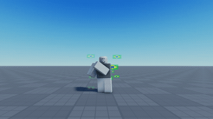 | 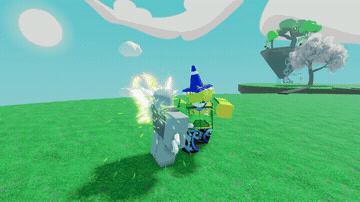 | 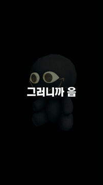 |
| **이모트 4일차** | **이모트 마니아** | **Loopin'** |
| 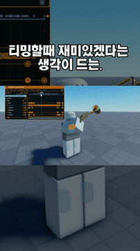 | 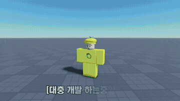 | 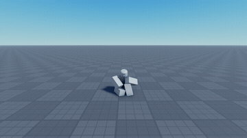 |
| **NULLED** | **SLAPS** | **Prince** |
| 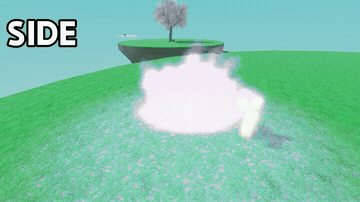 | 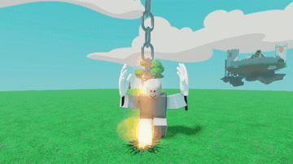 | 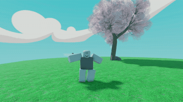 |
| **배너 1** | **0828** | **스비브** |
| 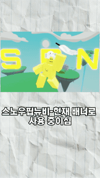 | 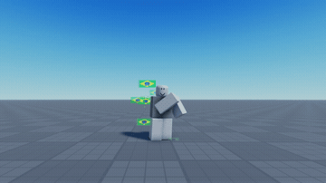 | 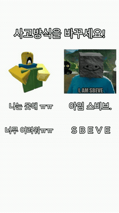 |

전체 영상 48개의 정지 캡처는 [`previews/stills/`](previews/stills/)에, 한눈에 보는 모음은 아래에 있습니다.

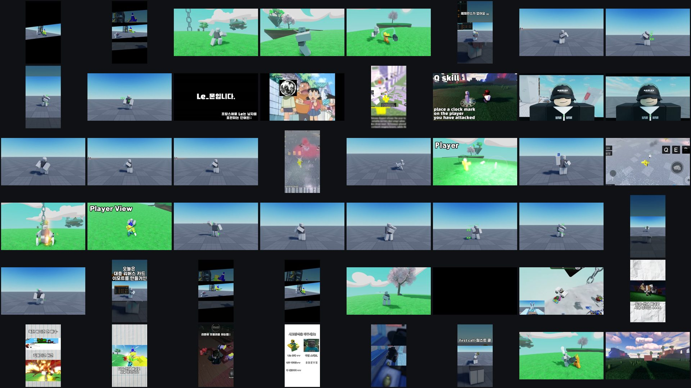

## 수상

**2026.06.16 · Slap Battles 커뮤니티 디스코드 이모트 애니메이션 이벤트 수상**

2주간의 심사 후 원래 10명이던 수상자를 15명으로 늘렸고, 그 15명 중 한 명으로 선정되어 상금 R$ 6,000을 받았습니다.
디스코드 프로필에 Event Winner, Contributor, Artist 역할이 부여되었습니다.

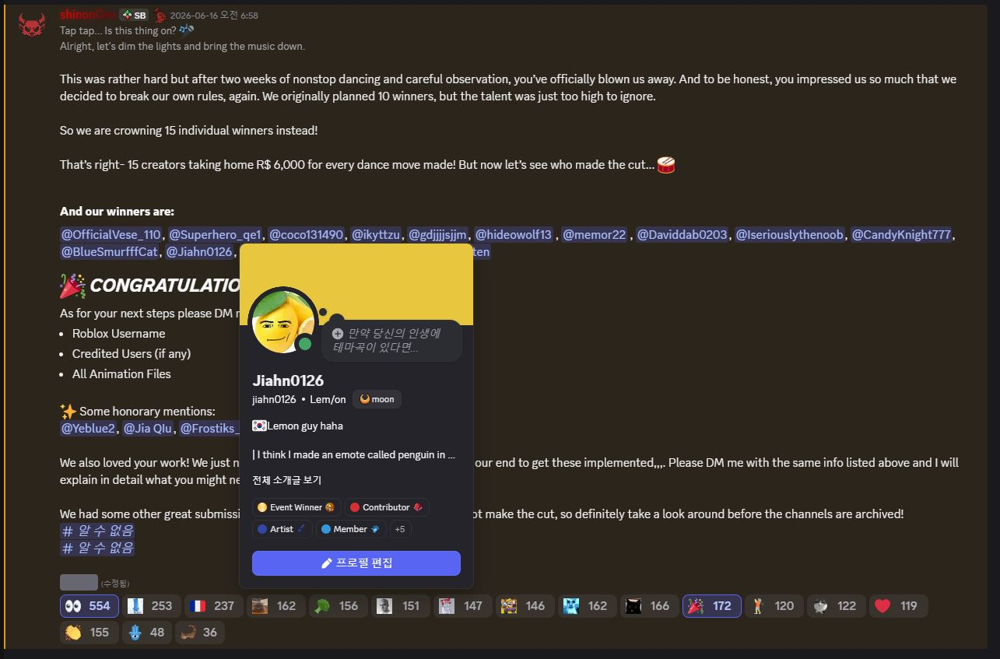

## 작품

| 날짜 | 제목 | 내용 |
|---|---|---|
| 2026.05.22 | 애니메이팅 – 펭귄 | Club Penguin의 이모트 Pizzatron 4000을 오마주한 애니메이션 |
| 2026.06.20 | 애니메이팅 – 슬로야 | 주술회전 나오야의 스킬을 슬랩배틀 애니메이션 스타일로 재구성 |
| 2026.08.30 | 애니메이팅 – 브라질 24/7 | 브라질 감성의 춤을 Roblox 안에서 애니메이팅. 이모트 만들기 2일차 영상의 소재 |
| 2026.08~09 | 슬랩배틀 이모트 만들기 1~4일차 | 이모트 제작 과정을 쇼츠로 기록 |
| 2026.09 | 슬랩배틀 유튜버 배너 만들기 1~3 | 유튜버들을 위한 배너 영상 제작 |

## YouTube

채널 **Le_몬** · 구독자 92명 · 동영상 15개 (2026.09 기준). 썸네일을 누르면 재생됩니다.

### 동영상

| | | |
|:---:|:---:|:---:|
|  |  |  |
| **슬랩배틀에서** · 2026.07.28 · 244회 | **MM2 animation test** · 2026.06.01 · 68회 | **게임을 20배속하면 생기는 일;;** · 2026.01.23 · 241회 |

### Shorts

| | | |
|:---:|:---:|:---:|
|  |  |  |
| **슬랩배틀 배너 만들기 3** · 2026.09.15 · 1,130회 | **사고방식을 바꾸세요!** · 2026.09.15 · 1,178회 | **슬랩배틀 이모트 만들기 4일차** · 2026.09.14 · 877회 |
|  |  |  |
| **슬랩배틀 유튜버들 배너 만들기 2** · 2026.09.13 · 1,186회 | **슬랩배틀 유튜버들 배너 만들기** · 2026.09.10 · 1,265회 | **슬랩배틀 이모트 만들기 3일차** · 2026.09.02 · 1,120회 |
|  |  |  |
| **이모트 만들기 2일차(리메이크)** · 2026.09.02 · 372회 | **이모트 만들기 2일차 (바르질 24/7)** · 2026.09.01 · 929회 | **슬랩배틀 이모트 만들기 1일차** · 2026.08.19 · 1,289회 |
|  |  |  |
| **로블록스 MM2 콤보** · 2026.06.01 · 248회 | **게임을 20배속하면 생기는 일...** · 2026.01.26 · 1,492회 | **고수들 특 :** · 2025.12.19 · 1,923회 |

## 파일

| 폴더 | 내용 |
|---|---|
| [`roblox/animations/`](roblox/animations/) | 애니메이션 리그 파일 (`two_time.rbxm`, `Penguin.rbxm`) |
| [`roblox/rigs-and-models/`](roblox/rigs-and-models/) | 작업에 쓴 리그·소품·파티클 (`WardenRig`, `DeluxeRevolver`, `Moss`, `ParticlePacks`) |
| [`roblox/places/`](roblox/places/) | 촬영용 맵 (`sad.rbxl`, `ChooseYourPower_OldMap.rbxl`, `Forsaken.rbxl`) |
| [`previews/gifs/`](previews/gifs/) | 대표 영상 GIF 미리보기 (6초, 360px) |
| [`previews/stills/`](previews/stills/) | 로컬 렌더 영상 48개의 정지 캡처 |
| [`awards/`](awards/) | 수상 공지 스크린샷 원본 |
| [`docs/`](docs/) | GitHub Pages 페이지 (YouTube 임베드 재생) |

원본 렌더 영상(4K, 총 1.5GB)은 용량 때문에 저장소에 넣지 않았습니다.

## 도구

Roblox Studio · Moon Animator · OBS · 영상 편집
